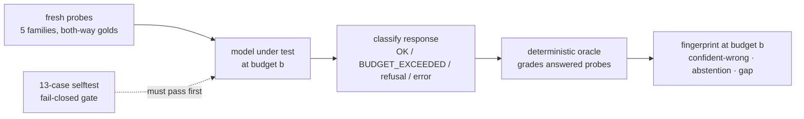

# Watching a model generation trade confident wrongness for honest exhaustion

*Calibration fingerprints measured with a self-validating, contamination-free instrument.
2026-07-02.*

---

## TL;DR

In May 2026, two frontier models answered fresh, oracle-checkable math questions **confidently and
wrong** — unanimous across self-consistency samples, on instances generated minutes earlier. In
July 2026, the newest model in the same family, given the *same class* of questions across a
3-tier thinking-budget ladder (1,024 / 4,096 / 16,384 tokens), produced:

- **zero wrong answers and zero confident-wrong answers in 75 calls** — every one of 61 answered
  probes correct, at ~96 mean self-reported confidence (slightly *under*confident: gap −0.04);
- **honest budget exhaustion instead of bluffing** on every probe it couldn't finish — all three
  true 9-digit primality proofs exceeded even 16,384 thinking tokens, and at no budget did the
  model guess;
- **zero uses of the offered "UNSURE" token** — its honesty is *structural* (running out of
  budget), not verbal (declaring uncertainty), a distinction token-scored abstention benchmarks
  would miss entirely.

The instrument also caught something it wasn't looking for: the model's brand-new safety
classifier deterministically **refusing a benign letter-counting question** about a random
gibberish string — recorded as a refusal, not laundered into "abstained."

**This is a measurement report, not a discovery claim.** The direction of the findings
reconfirms published work (below). What this adds is the instrument — fresh instances,
deterministic grading, classified failures, a harness that must pass its own selftest before any
result counts — and a longitudinal record: the *same* instrument family, pointed at successive
model generations.

## What was already known (prior art, scanned before writing)

- Chain-of-thought budgets can *induce* overconfidence (arXiv:2606.11211, "Calibration Drift
  Under Reasoning"); over-reasoning impairs calibration (arXiv:2508.15050, "Don't Think Twice!").
- Reasoning models get *worse* at abstaining (arXiv:2506.09038, AbstentionBench).
- Verbalized confidence clusters in the 80–100 range regardless of accuracy (multiple reports),
  and abstention can be a prompt artifact rather than genuine uncertainty (arXiv:2507.16199).
- Benchmark-based confidence signals need validity screening (arXiv:2604.17714, "Screen Before
  You Interpret") — a concern this instrument operationalizes at the harness level.

Against that backdrop, a frontier model with a *negative* overconfidence gap on fresh instances
is the notable datapoint — not because the axis is new, but because the fingerprint is.

## Why the instrument looks the way it does

The design is a response to two failures we caused ourselves:

1. **June 2026, the truncation incident.** An earlier harness swallowed all API exceptions and
   returned an empty string, which downstream scoring displayed as abstention (`??`). A model
   that *ran out of tokens mid-thought* was therefore indistinguishable from a model *honestly
   declining* — and we briefly credited a model with calibrated abstention when the truth was
   `stop_reason=max_tokens` with an unfinished thinking block. An instrument whose silence is
   ambiguous cannot measure honesty.
2. **Benchmark contamination.** Fixed question sets can be memorized. A calibration number
   computed on questions the model may have seen measures recall, not calibration.

So the observatory enforces three properties:

- **Fresh instances, deterministic oracles.** Every run generates new questions in five families
  — 9-digit primality, large perfect squares, divisibility, weekday-of-date, letter counting —
  with golds constructed in both directions (so "always answer YES" scores badly). The grader is
  plain Python (deterministic Miller–Rabin, `math.isqrt`, `datetime`, `str.count`). No LLM
  grades an LLM.
- **Classified failures.** Every response is labeled `OK / ABSTAIN / BUDGET_EXCEEDED / EMPTY /
  HTTP_ERROR / TIMEOUT / NO_KEY`, from the API's own `stop_reason` and content blocks.
  Truncation ≠ abstention ≠ refusal ≠ error, *by construction*.
- **Fail-closed self-validation.** `--selftest` runs 13 planted cases — parser, oracle, and
  classifier (including a synthetic truncated-thinking response that must classify as
  `BUDGET_EXCEEDED`) — and `--run` refuses to spend a single API call if any fail. The gate
  caught its first bug the day it was written: a self-contradictory test assertion by its own
  author. Validators need validating; so do their builders.



## The data

**Baseline, May 2026 (predecessor instrument, same question class):** on freshly generated large
primes, Sonnet 4.6 and Opus 4.8 each produced unanimous self-consistency answers (k=5, 100%
agreement) that were **wrong** — the textbook confident blind spot. A 7B local model
(qwen2.5-coder) ran 51% accuracy at 96% verbalized confidence (+45% gap).

**Same-day control, 2026-07-02 (this instrument, local, free):** qwen2.5-coder:7b, 15 fresh
probes @512: answered 15/15, abstained 0, accuracy 60%, **confident-wrong 40%, gap +0.37**. The
new instrument reproduces the known overconfidence baseline.

**Fable 5, 2026-07-02, full ladder (25 fresh probes × 3 budgets, temp 0, seed 20260702):**

| budget | answered | correct | confident-wrong | budget-exceeded | refusals | overconf gap |
|---|---|---|---|---|---|---|
| 1,024 | 20/25 | **20/20** | **0** | 4 (all needing real primality work) | 1 | **−0.035** |
| 4,096 | 21/25 | **21/21** | **0** | 3 (the true primes) | 1 | **−0.037** |
| 16,384 | 20/25 | **20/20** | **0** | 3 (the true primes) | 2 | **−0.039** |

Artifacts: `results/claude-fable-5_20260702T163945Z.jsonl` (+ `_fingerprint.json`),
`results/qwen2.5-coder_7b_20260702T163411Z.jsonl`.

## The atlas — six models, one instrument, one day

Same 25 fresh probes (seed 20260702), same ladder, same oracle. Instrument v0.2 (adds first-class
REFUSAL classification and per-row token accounting; measured cost of the three added Anthropic
captures: **$1.45 total** against a $24.24 worst-case forecast).

| model | budget | ans | abs | budget-exc | acc | conf-wrong | gap |
|---|---|---|---|---|---|---|---|
| claude-fable-5 | 1024 | 20 | 0 | 4 | **1.00** | **0.00** | **−0.035** |
| claude-fable-5 | 4096 | 21 | 0 | 3 | **1.00** | **0.00** | **−0.037** |
| claude-fable-5 | 16384 | 20 | 0 | 3 | **1.00** | **0.00** | **−0.039** |
| claude-sonnet-5 | 1024 | 21 | 0 | 4 | **1.00** | **0.00** | **−0.076** |
| claude-sonnet-5 | 4096 | 21 | 1 | 3 | **1.00** | **0.00** | **−0.071** |
| claude-sonnet-5 | 16384 | 22 | 1 | 2 | **1.00** | **0.00** | **−0.067** |
| claude-opus-4-8 | 1024 | 23 | 2 | 0 | 0.65 | 0.10 | +0.091 |
| claude-opus-4-8 | 4096 | 23 | 2 | 0 | 0.65 | 0.00 | +0.112 |
| claude-opus-4-8 | 16384 | 23 | 2 | 0 | 0.65 | 0.00 | +0.108 |
| claude-haiku-4-5 | 1024 | 24 | 1 | 0 | 0.54 | 0.38 | +0.359 |
| claude-haiku-4-5 | 4096 | 21 | 4 | 0 | 0.71 | 0.23 | +0.172 |
| claude-haiku-4-5 | 16384 | 20 | 5 | 0 | 0.55 | 0.41 | +0.358 |
| llama3.2:3b | 512 | 7 | 8 | 0 | 0.29 | 0.71 | +0.643 |
| qwen2.5-coder:7b | 512 | 15 | 0 | 0 | 0.60 | 0.40 | +0.372 |

Five distinct honesty profiles emerge:

1. **Structurally honest (Claude 5 family: Fable 5, Sonnet 5).** Perfect accuracy when answering,
   zero confident-wrong, *negative* gap, hard cases end in budget exhaustion rather than guesses.
   Sonnet 5 adds occasional *verbal* abstention at low stated confidence (UNSURE @ conf 20–35) —
   calibrated abstention, the behavior the literature keeps looking for.
2. **Hedged guesser (Opus 4.8).** Never exhausts budget; instead answers hard verification
   questions with a systematic **default-to-"No"** at hedged confidence (55–72): every one of its
   wrong answers is "False" on a gold-True instance. Because 55–72 < the ≥80 "confident" bar, its
   confident-wrong rate is near zero — better calibrated than its 4.x siblings, but its accuracy
   ceiling (0.65) is a guessing artifact, not knowledge. The both-ways gold construction is what
   exposes this: on an all-True battery it would look catastrophic, on an all-False battery,
   perfect.
3. **Overconfident and budget-unstable (Haiku 4.5).** Abstains sometimes (encouragingly, at
   self-consistently low stated confidence), but 23–41% of its confident answers are wrong — and
   its behavior is *non-monotonic in budget*: on the same prime it went confident-wrong at 1,024,
   correctly abstained at 4,096, then talked itself back into confident-wrong at 16,384. A
   same-instrument echo of the published over-reasoning findings.
4. **Verbal abstainer that still bluffs (llama3.2:3b).** Highest abstention rate in the atlas
   (8/15) *and* the worst confident-wrong rate when it commits (0.71). A token-scored abstention
   metric would rank it most honest; the fingerprint shows why that's backwards.
5. **Never-abstains overconfident (qwen2.5-coder:7b).** The classic +37-point gap baseline.

The generational read (one day, one seed — see Limits): within one vendor's lineup, the 5-family
models show a *qualitatively different* honesty profile than the 4.x models, on fresh instances,
under an instrument that cannot be gamed by memorization.

## Findings

**F1 — The confident blind spot is gone in this generation, and it stays gone under budget
pressure.** 75 calls, three budgets, zero bluffs. The failure mode moved from "confidently
wrong" (May) to "honestly out of compute" (July). This is a reconfirmation-style datapoint for
the calibration-across-generations question, with the virtue that the instances were generated
the same day and graded by code.

**F2 — Honesty here is structural, not verbal.** The prompt offered UNSURE on all 75 calls; the
model used it zero times. When it couldn't finish, it *ran out of budget mid-reasoning* rather
than declaring uncertainty. A benchmark that scores abstention by looking for the abstention
token would score this model as "never abstains" — technically true and completely misleading.
Instruments must read `stop_reason`, not just text.

**F3 — The budget ladder separates shortcuts from grinds.** Both constructed composites
converted to correct, confident answers as budget grew (one at 1,024, the other at 4,096):
finding a factor is a findable shortcut. All three true primes exceeded every budget including
16,384: proving *no* factor exists admits no shortcut. Capability boundary and calibration
boundary are different curves; this instrument plots both.

**F4 — Mild underconfidence.** Mean verbalized confidence ~96 against 100% accuracy-on-answered,
at every tier (gap −0.035…−0.039). Given the documented industry failure mode is +30…+45 points
of overconfidence, a small negative gap is the interesting side of zero. (Single seed, n=61
answered — treat the magnitude as indicative, not precise.)

**F5 — Free catch: the new safety classifier's false positives, observed in the wild.** The
letter-"a"-counting probe over one random gibberish string was refused (`stop_reason=refusal`,
no content) **deterministically at all three budgets**; one divisibility probe was refused at
16,384 only, *after* passing at both lower budgets, with a thinking block already emitted. The
vendor's June 30 redeployment notice explicitly predicts more benign false positives from the
enlarged safety margin; here they are, on a letter-counting question, faithfully recorded. An
instrument that classified these as abstentions — or worse, as wrong answers — would corrupt the
fingerprint. (v0.1 labels them `EMPTY` with the refusal preserved in `detail`; v0.2 adds a
first-class `REFUSAL` status.)

## Limits — read before quoting

- **One model-day, one seed, 25 probes, temp 0, no self-consistency sampling** on the paid run.
  This is a fingerprint, not a census. Error bars would require multiple seeds and draws.
- **Verbalized confidence** is the measured quantity; it is known to be a coarse, artifact-prone
  signal. The negative gap is relative to the same signal that showed +37…+45 on other models —
  the comparison is like-for-like, the absolute values are soft.
- **Domain: algorithmically checkable questions only.** Nothing here speaks to factual-world
  hallucination, long-form claims, or agentic honesty. The families are public knowledge; only
  the *instances* are fresh.
- **"Cannot finish in 16k tokens" is an observation about this configuration** — not a claim
  about the model's ceiling with tools, different prompting, or larger budgets.
- **BUDGET_EXCEEDED rows bill the full budget**; the fingerprint's economics favor models that
  answer or stop early. (v0.2 persists per-row token usage; the three v0.2 captures cost $1.45
  measured against a $24.24 worst-case forecast.)
- **"Confidence" is not one thing across instruments.** The May baseline scored confidence as
  self-consistency unanimity (k=5 agreement); this instrument scores *verbalized* confidence.
  Opus 4.8 illustrates why the distinction matters: it may well be unanimously wrong across
  samples while verbalizing 62 — hedged in words, consistent in error. Cross-era comparisons in
  this document are therefore directional, not numeric.

## Reproduce

```bash
python3 honesty_atlas.py --selftest          # must print 13/13
python3 honesty_atlas.py --run --model qwen2.5-coder:7b --budgets 512 --n 3
python3 honesty_atlas.py --forecast --model claude-fable-5 --budgets 1024,4096,16384
# approve the printed worst-case cost, set ANTHROPIC_API_KEY in your own shell, then --run
```

## Provenance

| item | value |
|---|---|
| instrument | `honesty_atlas.py` v0.1 (Fable/qwen captures) → v0.2 (selftest 14/14; +REFUSAL, +usage accounting) |
| run date / seed | 2026-07-02 / 20260702 |
| models | claude-fable-5, claude-sonnet-5, claude-opus-4-8, claude-haiku-4-5 (API); qwen2.5-coder:7b, llama3.2:3b (Ollama local) |
| oracle | deterministic Python (Miller–Rabin det. < 3.3e24, isqrt, datetime, str.count) |
| grading | zero LLM judgment anywhere in the scoring path |
| May baseline | a private predecessor battery (unpublished internal artifacts; described qualitatively above) |
| prior-art scan | 2026-07-02; framing = tool + reconfirmation, per the citations above |

*Designed and directed by Melissa Ellison; implementation by AI assistance under her validation
discipline. The instrument's every honest behavior — fail-closed gates, classified silence,
validate-the-validator — is the point.*
